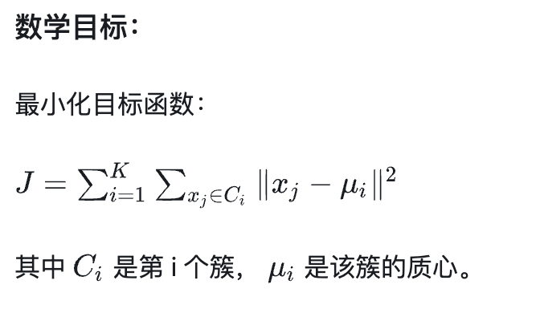

## 无监督学习
无监督学习的核心特征是：数据没有标签（label）。模型的任务，不是预测一个值，而是从数据中发掘结构、规律、分布或潜在变量。

常见的无监督学习任务包括：

聚类（Clustering）：把相似的样本归为一类（例如把客户分为高价值、中价值、低价值）
降维（Dimensionality Reduction）：把高维数据压缩成低维表示（便于可视化、建模）
异常检测：识别与多数数据分布显著不同的点
关联分析：发现变量之间的关联规则（如购物篮分析）
### 聚类Clustering 
找出隐藏的群体结构
#### KMeans：最经典的聚类算法
核心思想：KMeans 假设数据可以被划分为 K 个高斯分布，每个类有一个“质心”，通过最小化每个点到其所属簇中心的距离进行聚类。

算法流程：
初始化：随机选择 K 个初始质心
分配样本：将每个样本分配给最近的质心
更新质心：计算每个簇内所有点的均值作为新的质心
重复步骤 2-3，直到质心不再变化或达到最大迭代次数

数学目标函数：

优点：简单高效，适用于大数据集，可并行加速实现
缺点：需要预先指定 K 值，对异常值敏感，可能陷入局部最优

如何选择最佳的K值：\
肘部法（Elbow Method）：绘制不同 K 值对应的 SSE（Sum of Squared Errors）曲线，选择肘部位置的 K 值,SSE是簇内相似度，$$SSE = \sum_{i=1}^{n} \sum_{x_i \in C_k} \|x_i - \mu_k\|^2$$ \
轮廓系数（Silhouette Score）：计算不同 K 值的轮廓系数，选择轮廓系数最高的 K 值 \
平均轮廓系数（Average Silhouette Score）：计算所有样本的轮廓系数平均值，选择平均轮廓系数最高的 K 值\

#### DBSCAN：基于密度的聚类算法

核心思想：DBSCAN 通过密度连接的方式来定义簇，能够发现任意形状的簇，并且不需要预先指定簇的数量。\
与 KMeans 假设所有簇是“球形且大小差不多”不同，DBSCAN 完全不需要你事先指定聚类的个数，它通过两个参数（ε 和 min_samples）来自动发现“密集点簇”。\

DBSCAN 的思想可以用一句话概括：

“一个点如果被很多邻居包围，就是簇的核心；核心点扩张出去可以把边界点‘拉进来’，最终形成一个密度连通区域。”

要理解DS SCAN，我们需要先定义几个概念：
1. ε-邻域：对于一个点 p，ε-邻域是指距离 p 不超过 ε 的所有点的集合，使用欧式距离。
2. 核心点：如果一个点 p 的 ε-邻域内至少有 min_samples（密度阈值） 个点（包括 p 本身），则 p 是一个核心点。
3. 可达关系：如果点 q 在点 p 的 ε-邻域内，并且 p 是核心点，则 q 是可达的。
4. 密度连接：如果点 p 和点 q 之间存在一个点序列 p1, p2, ..., pn，使得 p1 = p，pn = q，并且对于每个 i，pi+1 是 pi 的 ε-邻域内的点，并且 pi 是核心点，则称 p 和 q 是密度连接的。

DBSCAN 的算法流程如下：
给定数据集 D 和参数 ε 和 min_samples：
1. 初始化：将所有点标记为未访问。
2. 对于数据集中的每个点 p：
   a. 如果 p 已经被访问过，跳过。
   b. 否则，标记 p 为已访问。
   c. 获取 p 的 ε-邻域内的所有点 N。
   d. 如果 N 中的点数小于 min_samples，则将 p 标记为噪声点。
   e. 否则，创建一个新的簇 C，并将 p 添加到 C 中。
   f. 对于 N 中的每个点 q：
      i. 如果 q 没有被访问过，标记 q 为已访问。
      ii. 获取 q 的 ε-邻域内的所有点 Nq。
      iii. 如果 Nq 中的点数大于或等于 min_samples，则将 Nq 中的所有点添加到 N 中。
      iv. 如果 q 不在任何簇中，则将 q 添加到 C 中。
3. 重复步骤 2，直到所有点都被访问过。
优点：能够发现任意形状的簇，不需要预先指定簇的数量，对异常值不敏感
缺点：对参数 ε 和 min_samples 的选择敏感，可能无法处理高维数据，无法处理不同密度的簇

如何选择最佳的 ε 和 min_samples：\
k-距离图（k-distance graph）：对于每个点，计算其与第 k 个最近邻的距离，并绘制这些距离的排序图，选择图中出现明显拐点的位置作为 ε 的值。\
领域密度分析：通过分析数据的密度分布，选择一个合适的 ε 值，使得核心点能够覆盖大部分数据点，同时选择一个合适的 min_samples 值，通常建议设置为数据集维度的两倍。\
交叉验证：使用不同的 ε 和 min_samples 组合进行聚类，并评估聚类结果的质量（例如使用轮廓系数、Davies-Bouldin 指数等指标），选择性能最好的参数组合。

### 降维
在高维度中寻找核心变量

#### PCA：主成分分析
场景：
图像特征压缩
信号处理
可视化
特征预处理（例如在聚类或回归前）

核心思想：PCA 通过线性变换将原始数据投影到一个新的坐标系中，使得投影后的数据在新坐标系中的方差最大。PCA 的目标是找到数据中最重要的方向（主成分），并将数据投影到这些方向上，从而实现降维。

算法流程：\
数据中心化：将数据的每个特征减去其均值，使得数据的均值为零。\
计算协方差矩阵：计算中心化后的数据的协方差矩阵，描述数据的分布情况。\
特征值分解：对协方差矩阵进行特征值分解，得到特征值和对应的特征向量。\
选择主成分：根据特征值的大小选择前 k 个特征向量，组成一个新的特征空间。\
数据投影：将原始数据投影到新的特征空间中，得到降维后的数据表示。\

优点：快速可解释性强，可用于特征压缩或者可视化
缺点：只能捕捉线性关系，对异常值敏感，可能丢失重要信息，对特征需要归一化/标准化处理

#### t-SNE：t-分布随机邻域嵌入 非线性可视化
t-SNE 并不关注全局结构，而是最大限度保留高维空间中“邻近点对”的关系，让局部结构在低维中尽可能保真。

优点： 擅长保留局部结构   可视化效果直观、丰富  适合 Embedding 可视化 \
局限： 不能用于特征压缩或后续建模 不可解释（黑盒）  对参数敏感、耗时较久 \

#### UMAP：统一流形近似和投影
UMAP 是一种基于流形学习的非线性降维方法，旨在通过构建高维空间中的邻接图来捕捉数据的局部结构，并通过优化低维空间中的邻接图来实现降维。UMAP 在保持局部结构的同时，也能够更好地保留全局结构，因此在某些情况下比 t-SNE 更适合用于特征压缩和后续建模。

### 项目实战案例：用户分群 + 文本 Embedding 可视化
在机器学习的实际应用中，我们常常会遇到“高维数据难以理解”的问题。尤其是在用户行为分析和自然语言处理（NLP）中：

用户行为数据维度高、种类多，怎么做用户分群？
文本经过 BERT 等模型嵌入后向量维度很高，如何可视化查看其分布效果？

用户分群（以电商用户为例）

你在做一个电商平台的数据分析，有如下特征可用于用户分群：

浏览次数
加购次数
购买次数
退货次数
最近消费时间（Recency）
消费频率（Frequency）
消费金额（Monetary）

我们使用一个开源的电商用户数据集：Online Retail II